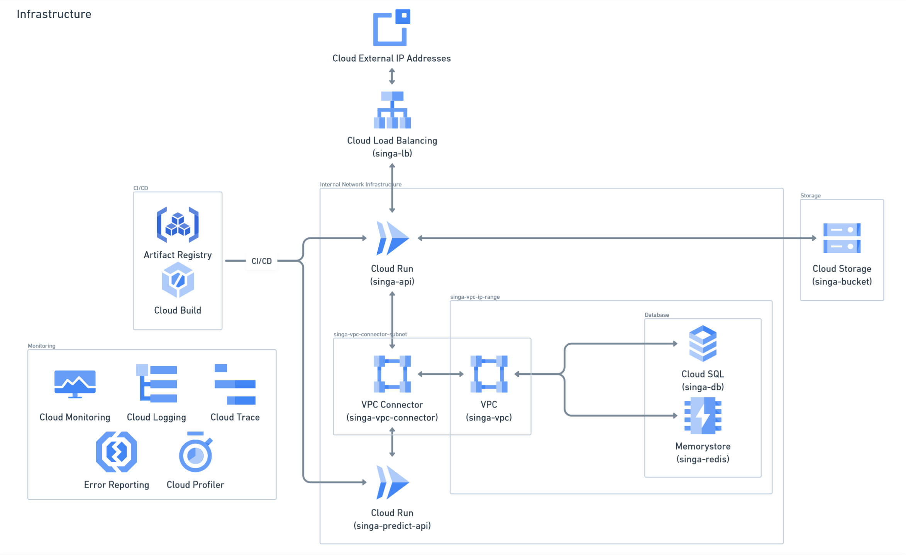

## Singa API

## Tech Used

- Python
- Tensorflow
- Mediapipe
- FastAPI

## API Documentation

## Setup Instructions

1. Clone this repository

```sh
git clone https://github.com/Signa-Lingua/sing-predict-api.git
```

2. Change directory

```sh
cd singa-predict-api
```

## Build, Push the backend to Artifact Registry and deploy to Cloud Run

### Prerequisites

#### For Google Cloud Environment

1. You have a Google Cloud Platform account, Google Project, and have installed the Google Cloud SDK on your local machine.
2. Setup ADC (Application Default Credentials) on your local machine.

   ```sh
   gcloud auth application-default login
   ```

3. You have created a Google Cloud Storage Bucket to store the logs.
4. You have created a service account to use for the Cloud Run and Cloud Build. It should have the following permission

   <details>
   <summary>Click to expand</summary>

   - Cloud Run Admin
   - Secret Manager Secret Accessor
   - Service Account User
   - Cloud Build Service Account

   </details>

5. You have created a Cloud Storage bucket to store the logs.

### Deploy using the following command

<details open>
<summary>Do it manually from gcloud CLI</summary>

```sh
gcloud builds submit --substitutions _VPC_CONNECTOR=<your-vpc-connector>,_MODEL_NAME=<your-model-name>,_SERVICE_ACCOUNT=<your-service-account>,_LOGBUCKET_NAME=<your-log-bucket-name>
```

</details>

## Infrastructure Overview


